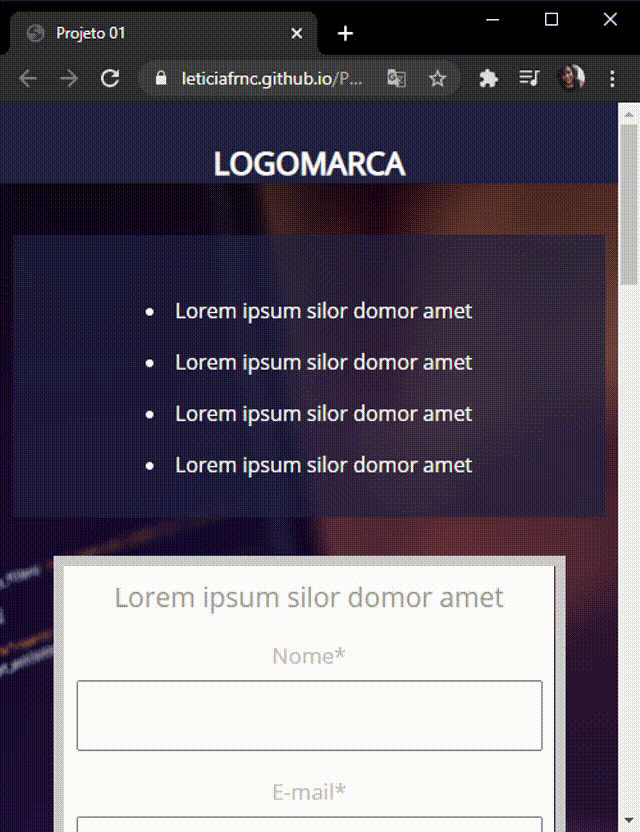

### Landing Page Simples

A Landing Page Simples foi desenvolvida com HTML5 e CSS3 com o objetivo de demostrar meu aprendizado.

### Características
Esta Landing Page apresenta um formato clean para demostrar seu trabalho, é adaptada em todas as telas.

### Instalação 

Clone este repositório usando git clone https://github.com/Leticiafrnc/landing-page-simples.git ou clique em Code/Download ZIP.
Clique no arquivo "index.HTML" e veja a aplicação.

### Observação: Se abrir a aplicação no celular, tablet ou qualquer tipo de tela a aplicação se adapta.

 
